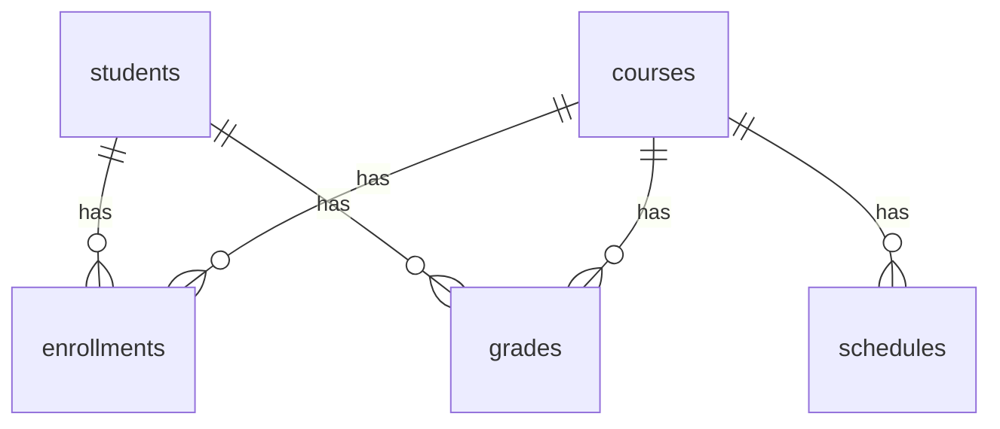

# Entity-Relationship Diagram (ER Diagram)

แผนภาพความสัมพันธ์ของตารางในฐานข้อมูล `sisdb` (`db/schema.sql`)

```mermaid
erDiagram
  students ||--o{ enrollments : has
  courses ||--o{ enrollments : has
  students ||--o{ grades : has
  courses ||--o{ grades : has
  courses ||--o{ schedules : has
```
